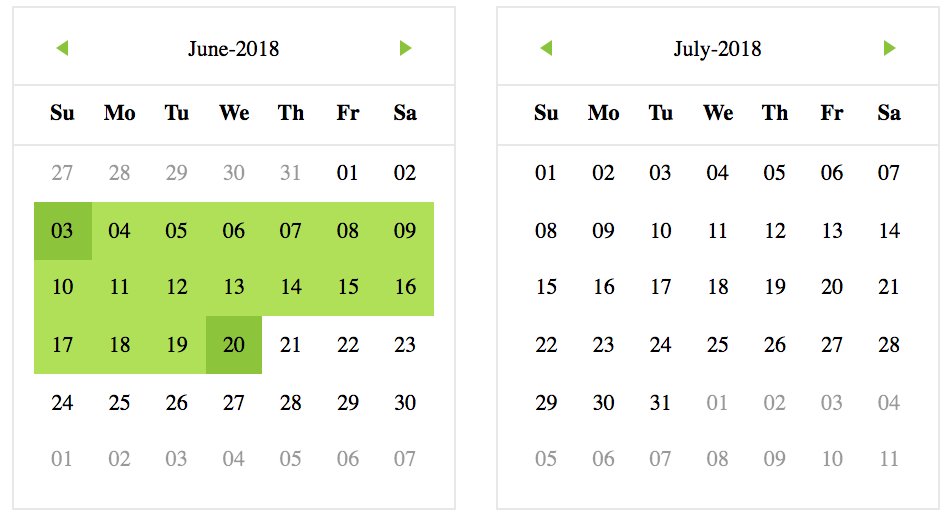

Install
-------
    npm install colored-calendar
    yarn add colored-calendar

Used
----

    import React, { Component } from 'react';
    import { SingleCalendar, ColoredCalendar } from "colored-calendar";

    class App extends Component {
      render() {
        return (
          

            <ColoredCalendar />
            <SingleCalendar />
          

        );
      }
    }

    export default App;

Props
-----

|    Prop    |    Default    |    Description     |
| :---         |     :---:      |          ---: |
| format   | YY.MM.DD | format of date which you used.  |
| colors     |  []  | Colors list  `[{color: "ccc", year: "18", month: "01", day: "01"}]`  |
| limit     |  0  | limited in choose days |
| firstDayOfWeek     |  1  |  |
| soloChoose     |  false  | singleton pick of date |
| switchDays     |  () => {}  | callback after switch range of days |
| switchMonth     |  () => {}  | callback after switch month |
